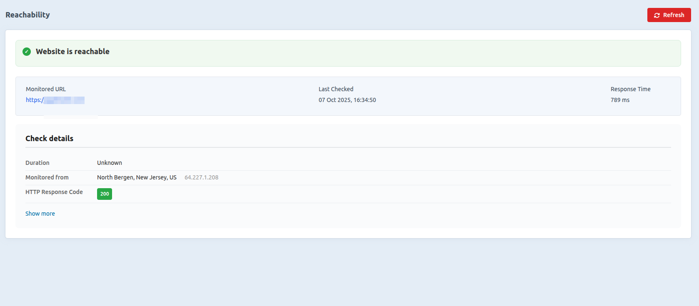
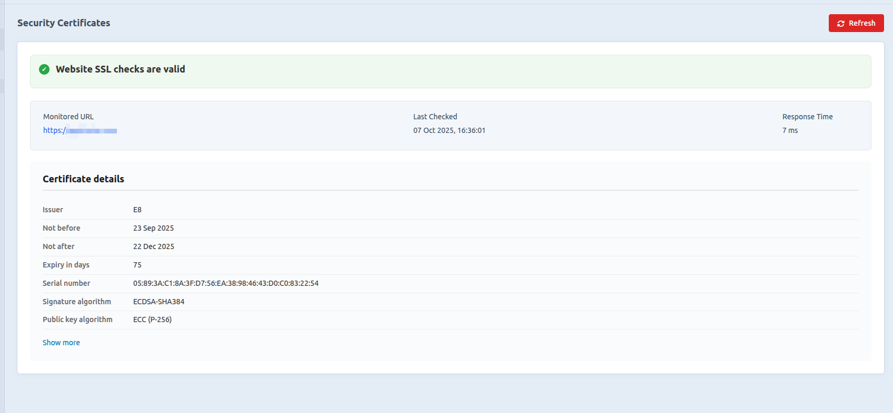
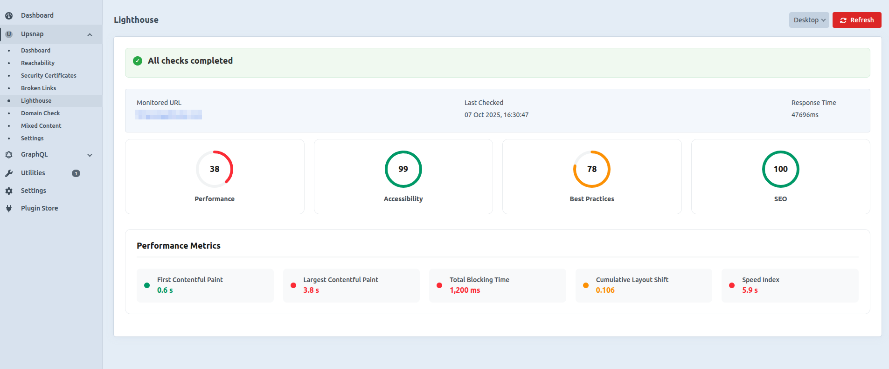
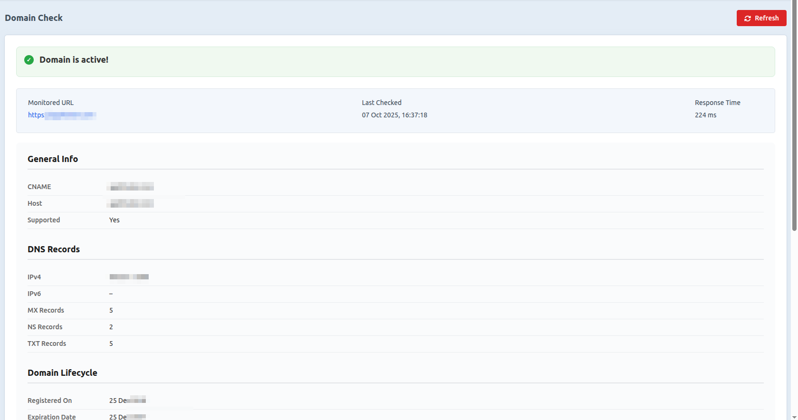

# Upsnap

A comprehensive monitoring plugin for Craft CMS that provides real-time insights into your website's health, performance, and security.


## Features

Upsnap provides a complete suite of monitoring tools to keep your Craft CMS site healthy and performing optimally:

### 🔍 **Reachability Monitoring**
- Real-time uptime monitoring
- Response time tracking
- HTTP status code monitoring
- Geographic monitoring locations
- Historical uptime data and trends

### 🔒 **Security Certificates**
- SSL/TLS certificate validation
- Certificate expiry monitoring
- Certificate chain verification
- Domain coverage analysis
- Security protocol detection

### 🔗 **Broken Links Detection**
- Comprehensive link scanning
- Internal/external link analysis
- Status code reporting
- Anchor text and context
- Bulk link validation

### 📊 **Lighthouse Performance Scores**
- Google Lighthouse integration
- Performance, Accessibility, Best Practices, and SEO scores
- Mobile and desktop analysis
- Core Web Vitals metrics
- Performance recommendations

### 🌐 **Domain Health Check**
- DNS record validation
- Domain expiry monitoring
- WHOIS information
- Domain status codes
- IPv4/IPv6 support

### 🔄 **Mixed Content Detection**
- HTTP/HTTPS mixed content scanning
- Security vulnerability identification
- Content type analysis
- Automated detection and reporting

## Requirements

- **Craft CMS**: 5.0.0 or later
- **PHP**: 8.2 or later
- **Database**: MySQL 8.0+ or PostgreSQL 13.0+

## Installation

### Via Composer (Recommended)

1. Open your terminal and navigate to your Craft project root
2. Run the following command:

```bash
composer require appfoster/upsnap -w && php craft plugin/install appfoster/upsnap
```

### Plugin Settings

After installation, configure the plugin through the Craft Control Panel:

1. Go to **Settings → Plugins → Upsnap**
2. Configure the following options:
   - **Monitoring URLs**: Additional URLs to monitor
   - **Enable Monitoring**: Toggle monitoring on/off
   - **Monitoring Interval**: Set check frequency (minutes)
   - **Notification Email**: Email for alerts

## Usage

### Accessing the Plugin

1. Log into your Craft Control Panel
2. Navigate to **Upsnap** in the main navigation
3. Choose from the available monitoring sections

### Monitoring Sections

#### Reachability
Monitor your site's uptime and response times.



#### Security Certificates
Check SSL certificate validity and security.



#### Broken Links
Scan for and identify broken links across your site.


#### Lighthouse Scores
View Google Lighthouse performance metrics.



#### Domain Check
Monitor domain health and DNS configuration.



#### Mixed Content
Detect HTTP resources on HTTPS pages.


#### Monitors Listing
Manage you monitors from one place.


#### Status Pages Listing
Shareable Status Pages to track the monitors across teams.


## Troubleshooting

### Common Issues

**Plugin not appearing in Control Panel**
- Ensure the plugin is installed via Composer
- Check file permissions on the plugin directory
- Clear Craft's cache: `php craft clear-caches/all`

**Monitoring Not Working**
- Confirm the target URL is accessible
- Check firewall and security settings

### Debug Mode

Enable Craft's debug mode to see detailed error messages:

```php
// config/app.php
return [
    'modules' => [
        'debug' => [
            'class' => 'yii\debug\Module',
            'allowedIPs' => ['127.0.0.1', '::1'],
        ],
    ],
];
```

## Development

### Project Structure

```
upsnap/
├── src/
│   ├── Upsnap.php          # Main plugin class
│   ├── Constants.php            # Plugin constants
│   ├── assetbundles/            # Frontend assets
│   ├── controllers/             # Control Panel controllers
│   ├── models/                  # Data models
│   ├── services/                # Business logic services
│   └── templates/               # Twig templates
├── composer.json
└── README.md
```

### Contributing

1. Fork the repository
2. Create a feature branch
3. Make your changes
4. Add tests if applicable
5. Submit a pull request


## Support

### Documentation
- [Full Documentation](https://github.com/Appfoster/upsnap/wiki)

### Issue Tracking
- [GitHub Issues](https://github.com/Appfoster/upsnap/issues)
- [Changelog](https://github.com/Appfoster/upsnap/blob/master/CHANGELOG.md)

### Contact
- **Email**: support@appfoster.com
- **Website**: [Appfoster](http://www.appfoster.com/)

## License

This plugin is proprietary software. See the LICENSE file for details.

---

**Built with ❤️ by [Appfoster](http://www.appfoster.com/)**

*Keep your Craft CMS sites healthy and performing at their best with Upsnap.*